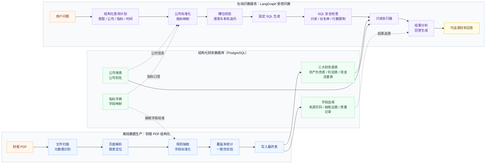

# 财报 PDF 数据结构化 + LangGraph 财报问数 Agent

一个把上市公司财报 PDF 转成 PostgreSQL 结构化财务表，并用 LangGraph 构建受控财务问数 Agent 的端到端项目。

## 竞赛背景

本项目来源于 2026 年第 14 届“泰迪杯”数据挖掘挑战赛 B 题：上市公司财报“智能问数”助手。赛题面向资本市场财报分析场景，要求从上市公司年报 PDF 中抽取结构化财务数据，并在此基础上构建支持自然语言查询、多轮追问、意图澄清和结果分析的财报问数助手。

本仓库聚焦两条核心链路：一是将非结构化财报 PDF 解析为可查询、可校验、可追踪的结构化财务数据库；二是基于 LangGraph / LangChain 构建受控问数 Agent，使用户能够通过中文问题查询公司财务指标、趋势、同比、对比和排名结果。

## 项目亮点

- 从非结构化财报 PDF 抽取三大财务报表，写入标准化 PostgreSQL 表。
- Agent 不直接读 PDF，也不让 LLM 自由生成财务数值，回答基于数据库查询结果。
- 自然语言先转为结构化 `QueryPlan`，再经过公司标准化、指标映射、槽位校验和固定 SQL 节点。
- SQL 执行前经过 SQL Guard，只允许受控只读查询。
- 支持单点查询、趋势、同比、派生指标、公司对比、排名、排名位置和多轮追问。
- 支持字段级 lineage、抽取覆盖率、运行摘要和财务一致性校验。

## 系统架构图



## Demo

### CLI Demo

```bat
python scripts\agent_demo_cli.py
```

进入后输入问题，输入 `exit` 退出。

```text
财报问数 Agent Demo
输入 exit 退出
当前模式：普通

用户：华润三九 2024 年营业收入是多少？
Agent：根据数据库查询结果，华润三九医药股份有限公司 2024 年年报中：

- 营业收入：276.17 亿元

用户：那净利润呢？
Agent：根据数据库查询结果，华润三九医药股份有限公司 2024 年年报中：

- 净利润：37.78 亿元

用户：华润三九 2024 年净利润排名
Agent：华润三九 2024 年净利润为 37.78 亿元，从高到低排名第 2 / 62。

按名次位置看，华润三九处于前 10% 区间，属于前 25%。
```

### 跟踪模式

```bat
python scripts\agent_demo_cli.py --trace
```

Trace 模式适合展示 Agent 执行链路：

```text
财报问数 Agent Demo
输入 exit 退出
当前模式：Debug / Trace

用户：华润三九 2024 年营业收入是多少？
[route] new_query
[intent] point_query
[company] 华润三九 -> 华润三九医药股份有限公司
[metric] 营业收入 -> total_operating_revenue
[time] 2024 FY
[sql_guard] passed
[sql] SELECT c.stock_code, c.stock_abbr, c.company_name, i.report_year AS report_year, 'FY' AS report_period, i.total_operating_revenue AS income_sheet__total_operating_revenue FROM c...
[answer] 根据数据库查询结果，华润三九医药股份有限公司 2024 年年报中：

- 营业收入：276.17 亿元

用户：同比呢
[route] contextual_followup
[intent] yoy_query
[company] 华润三九 -> 华润三九医药股份有限公司
[metric] 营业收入 -> total_operating_revenue
[time] 2024 FY
[sql_guard] passed
[sql] SELECT c.stock_code, c.stock_abbr, c.company_name, i.report_year AS report_year, 'FY' AS report_period, i.total_operating_revenue AS income_sheet__total_operating_revenue FROM c...
[answer] 根据数据库查询结果，华润三九医药股份有限公司 2024 年年报中：

营业收入为 276.17 亿元，2023 年为 247.39 亿元，同比增加 28.78 亿元，同比增速为 11.63%。

用户：云南白药呢
[route] contextual_followup
[intent] yoy_query
[company] 云南白药 -> 云南白药集团股份有限公司
[metric] 营业收入 -> total_operating_revenue
[time] 2024 FY
[sql_guard] passed
[sql] SELECT c.stock_code, c.stock_abbr, c.company_name, i.report_year AS report_year, 'FY' AS report_period, i.total_operating_revenue AS income_sheet__total_operating_revenue FROM c...
[answer] 根据数据库查询结果，云南白药集团股份有限公司 2024 年年报中：

营业收入为 400.33 亿元，2023 年为 391.11 亿元，同比增加 9.22 亿元，同比增速为 2.36%。

```

### 示例问题

```text
华润三九 2024 年营业收入是多少？
华润三九 2024 年营业收入和净利润分别是多少？
华润三九近三年营业收入趋势如何？
华润三九 2024 年净利润同比增长多少？
华润三九 2024 年净利率是多少？
华润三九和云南白药 2024 年谁的营业收入更高？
2024 年营业收入最高的前 10 家公司是谁？
华润三九 2024 年营业收入排第几？
那净利润呢？
那排名呢？
```

更多展示案例见 [docs/demo_cases.md](docs/demo_cases.md)。

## 系统概览

```text
财报 PDF
  -> PDF Extraction Pipeline
  -> PostgreSQL
  -> LangGraph Agent
  -> Answer
```

系统分为两层：

- 数据层：把财报 PDF 转成可查询、可追溯、可校验的结构化财务数据库。
- Agent 层：把自然语言问题转成受控查询链路，并基于 SQL 结果生成回答。

## 支持能力

| 能力 | intent | 示例 |
| --- | --- | --- |
| 单指标查询 | `single_metric_query` | `华润三九 2024 年营业收入是多少？` |
| 多指标查询 | `multi_metric_query` | `华润三九 2024 年营业收入和净利润分别是多少？` |
| 趋势查询 | `trend_query` | `华润三九近三年营业收入趋势如何？` |
| 同比查询 | `yoy_query` | `华润三九 2024 年净利润同比增长多少？` |
| 派生指标查询 | `derived_metric_query` | `华润三九 2024 年净利率是多少？` |
| 派生指标趋势 | `trend_query` | `华润三九近三年净利率趋势如何？` |
| 派生指标同比 | `yoy_query` | `华润三九 2024 年净利率同比变化多少？` |
| 公司横向对比 | `company_compare_query` | `华润三九和云南白药 2024 年谁的营业收入更高？` |
| 公司趋势对比 | `company_compare_trend_query` | `华润三九和云南白药近三年营业收入谁增长更快？` |
| 公司同比对比 | `company_compare_yoy_query` | `华润三九和云南白药 2024 年谁的净利润同比增速更高？` |
| 数值排名 | `ranking_query` | `2024 年营业收入最高的前 10 家公司是谁？` |
| 同比增速排名 | `yoy_ranking_query` | `2024 年净利润同比增速最高的前 5 家公司是谁？` |
| 区间增长排名 | `trend_ranking_query` | `近三年营业收入增长最快的前 5 家公司是谁？` |
| 指定公司排名位置 | `rank_position_query` | `华润三九 2024 年营业收入排第几？` |
| 缺槽位澄清 | clarification | `2024 年营业收入是多少？` |
| 多轮追问 | contextual follow-up | `那净利润呢？`、`换成云南白药呢？` |

## 为什么不直接使用 Text-to-SQL？

本项目不采用“自然语言 -> LLM -> SQL”的自由 Text-to-SQL 路线。

原因是财务数据查询需要稳定口径和安全边界：

- `QueryPlan`：用户问题先被归一化为明确的 intent、公司、指标、时间范围、报告期和排名参数。
- 公司标准化：公司名称、简称、股票代码统一解析到 `company_dim` 和 `company_alias`。
- 指标映射：用户指标必须映射到 `data/metric_dictionary.json` 中的基础指标或派生指标公式。
- 槽位校验：公司、指标、年份、排名数量等缺失或歧义时先澄清，不猜测执行。
- 固定 SQL 节点：SQL 只由已注册 intent 对应的节点生成，不开放任意 SQL fallback。
- SQL Guard：执行前检查只读语句、禁止关键字、表白名单、函数白名单和 LIMIT。
- 只读执行：数据库入口集中在 `db/readonly_executor.py`，拒绝写操作、多语句和危险函数。

因此，LLM 只负责输出 `QueryPlan`、上下文 `route` 或 `slot_patch`，不直接写 SQL。

## 两个主要模块

### 财报 PDF 提取

主目录：`scripts/pdf_extraction/`

职责：

- 扫描财报 PDF 并建立 `report_file_index`。
- 识别公司、年份、报告期等元数据。
- 定位资产负债表、利润表、现金流量表。
- 基于字段字典和规则抽取财务字段。
- 写入最终标准表：`balance_sheet`、`income_sheet`、`cash_flow_sheet`。
- 记录字段级 `final_table_lineage`。
- 输出字段覆盖率、运行摘要和财务一致性校验结果。

主入口：

```bat
run_pipeline.bat
```

### LangGraph 财报问数 Agent

主目录：`agent/`

职责：

- 解析自然语言问题并生成 `QueryPlan`。
- 标准化公司和指标。
- 对缺失或歧义槽位发起澄清。
- 按 intent 路由到固定 SQL 生成节点。
- 执行 SQL Guard 和只读查询。
- 分析查询结果并生成中文回答。
- 支持多轮上下文补答和追问。

最小调用：

```python
from agent.graph import app

result = app.invoke({"user_question": "华润三九 2024 年营业收入是多少？"})
print(result["final_answer"])
```

## 多轮上下文

V0.7 多轮上下文不是让 LLM 记忆整段对话，而是基于 QueryPlan 做受控合并。

- `clarification_answer`：用户在回答上一轮澄清问题，例如系统问“请明确公司”，用户答“华润三九”。
- `contextual_followup`：用户基于上一轮成功查询继续追问，例如“那净利润呢？”、“换成云南白药呢？”。
- `intent_transition_need_clarification`：追问触发意图切换但缺必要参数，例如先问营业收入，后问“那排名呢？”，系统继续澄清排名范围或方向。

关键状态：

- `pending_query_plan`：保存缺槽位、待补完的 QueryPlan。
- `last_successful_query_plan`：保存上一轮成功回答的 QueryPlan。
- `slot_patch`：保存本轮用户补充或替换的局部槽位。

合并后仍必须重新走公司标准化、指标映射、槽位校验、SQL 生成、SQL Guard 和只读执行。

## 快速开始

### 安装依赖和配置环境

```bat
pip install -r requirements.txt
copy .env.example .env
```

在 `.env` 中配置 PostgreSQL 和本地数据目录即可运行 PDF 抽取流程。只有运行 Agent 的真实 LLM 节点或集成测试时，才需要额外配置 Agent 模型服务。数据库与安全配置示例见 [docs/database_initialization.md](docs/database_initialization.md) 和 [docs/security.md](docs/security.md)。

### PDF 结构化流程

```bat
run_pipeline.bat
```

或直接运行：

```bat
python scripts\pdf_extraction\run_pipeline.py
```

### Agent 命令行

```bat
python scripts\agent_demo_cli.py
```

Trace 模式：

```bat
python scripts\agent_demo_cli.py --trace
```

### 测试

```bat
python -m pytest tests
```

### 完整流程复现

完整 PDF 抽取流程、SQL 文件清单、lineage 查询和质量校验见 [docs/extraction_summary.md](docs/extraction_summary.md)，数据库初始化见 [docs/database_initialization.md](docs/database_initialization.md)。

## 文档

- [docs/architecture.md](docs/architecture.md)：系统架构说明。
- [docs/database_initialization.md](docs/database_initialization.md)：数据库初始化和账号建议。
- [docs/security.md](docs/security.md)：安全边界、配置策略和上传前检查。
- [docs/data_catalog.md](docs/data_catalog.md)：数据库范围、公司覆盖和指标覆盖说明。
- [docs/extraction_summary.md](docs/extraction_summary.md)：财报 PDF 数据提取总结。
- [docs/agent_workflow.md](docs/agent_workflow.md)：Agent 执行链路说明。
- [docs/v0.7_context_summary.md](docs/v0.7_context_summary.md)：V0.7 多轮上下文总结。
- [docs/demo_cases.md](docs/demo_cases.md)：展示案例。

## GitHub 数据策略

以下内容不随 GitHub 发布：

- 原始财报 PDF：`input/reports/`
- 本地数据库文件或导出数据库
- 运行产物：`output/`
- 日志：`logs/`
- 缓存：`__pycache__/`、`.pytest_cache/`
- 本地环境变量：`.env`
- 大体积样例数据：`示例数据/`
- 原始 Excel 附件和数据库文件

仓库只保留代码、SQL、轻量配置、文档、测试和 demo。运行项目需要在本地准备 PDF、PostgreSQL 和 `.env` 配置。

原始财报 PDF 及竞赛附件数据来源于“泰迪杯”数据挖掘挑战赛。由于数据体积和竞赛资料发布限制，仓库不直接提供原始 PDF、完整数据库和大型运行产物；如需复现实验，可根据赛题数据自行准备本地数据环境。

## 限制

- PDF 抽取以规则链路为主，不把整份 PDF 直接交给 LLM 做自由抽取。
- 财务一致性校验只记录诊断结果，不自动改写最终财务表数值。
- Agent 只回答结构化财务数据库能支持的问题。
- Agent 不提供投资建议、估值判断、实时行情或外部新闻查询。
- Agent 不支持任意 SQL 问答，也不支持自然语言转 SQL fallback。
- 不支持的 intent、缺失槽位或歧义输入会进入澄清或拒答。
- 原始 PDF、数据库和大型运行产物需要在本地环境准备。
